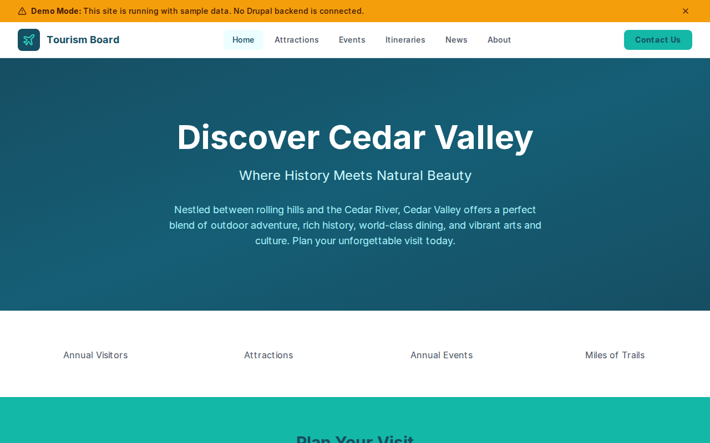

# Decoupled Tourism Board

A tourism board and visitors bureau website starter template for Decoupled Drupal + Next.js. Built for convention and visitors bureaus, destination marketing organizations, chambers of commerce, and regional tourism authorities.



## Features

- **Attractions** - Showcase local landmarks, museums, parks, arts venues, historic sites, and points of interest with hours, admission, and highlights
- **Events** - Promote festivals, concerts, art exhibitions, seasonal celebrations, and community happenings
- **Itineraries** - Curated visitor itineraries for different durations and themes with stops, audience, and detailed day-by-day plans
- **News** - Publish destination updates, press releases, event announcements, and visitor advisories
- **Modern Design** - Clean, accessible UI optimized for tourism and destination marketing content

## Quick Start

### 1. Clone the template

```bash
npx degit nextagencyio/decoupled-tourism-board my-tourism-board
cd my-tourism-board
npm install
```

### 2. Run interactive setup

```bash
npm run setup
```

This interactive script will:
- Authenticate with Decoupled.io (opens browser)
- Create a new Drupal space
- Wait for provisioning (~90 seconds)
- Configure your `.env.local` file
- Import sample content

### 3. Start development

```bash
npm run dev
```

Visit [http://localhost:3000](http://localhost:3000)

---

## Manual Setup

If you prefer to run each step manually:

<details>
<summary>Click to expand manual setup steps</summary>

### Authenticate with Decoupled.io

```bash
npx decoupled-cli@latest auth login
```

### Create a Drupal space

```bash
npx decoupled-cli@latest spaces create "My Tourism Board"
```

Note the space ID returned. Wait ~90 seconds for provisioning.

### Configure environment

```bash
npx decoupled-cli@latest spaces env 1234 --write .env.local
```

### Import content

```bash
npm run setup-content
```

This imports:
- Homepage with hero, stats (3.2M annual visitors, 150+ attractions, 200+ annual events, 75 miles of trails), and visitor CTA
- 4 attractions: Cedar Valley Heritage Museum, Cedar River State Park, Valley Arts Center, Historic Downtown District
- 3 events: Cedar Valley Jazz Festival, Autumn Harvest Festival, Summer First Friday Gallery Walk
- 3 itineraries: The Perfect Weekend Getaway, Three Days of Family Fun, Cedar Valley Culinary Trail
- 3 news articles: River Trail Extension, New Boutique Hotel, 2026 Summer Events Calendar
- 2 static pages: About Visit Cedar Valley, Getting Here & Getting Around

</details>

## Content Types

### Attraction
- **attraction_type**: Type taxonomy (Historic Site, Museum, Park & Nature, Arts & Culture, Food & Drink, Shopping, Recreation)
- **address**: Physical address
- **hours**: Operating hours
- **admission**: Admission price or policy
- **highlights**: Key highlights of the attraction
- **featured**: Whether the attraction is featured on the homepage
- **image**: Attraction image

### Event
- **event_date / end_date**: Event date and time range
- **venue**: Event venue or location
- **event_category**: Category taxonomy (Festival, Concert, Art Exhibition, Food & Wine, Sports, Family, Holiday)
- **admission**: Ticket price or admission policy
- **image**: Event promotional image

### Itinerary
- **duration**: Itinerary duration (e.g., "2 Days", "1 Day")
- **theme**: Theme taxonomy (Family Fun, Romantic Getaway, Outdoor Adventure, History & Culture, Food & Drink, Art & Design)
- **stops**: Key stops on the itinerary
- **best_for**: Who the itinerary is best suited for
- **image**: Itinerary image

### News
- **news_category**: Category taxonomy (Press Release, Destination Update, Event Announcement, Industry News, Visitor Advisory)
- **featured**: Whether the news item is featured
- **image**: Featured image

### Homepage
- **hero_title**: Main headline (e.g., "Discover Cedar Valley")
- **hero_subtitle**: Secondary tagline
- **hero_description**: Welcome message
- **stats_items**: Key statistics (visitors, attractions, events, trails)
- **featured_items_title**: Section heading for featured attractions
- **cta_title / cta_description**: Visitor call-to-action block

### Basic Page
- General-purpose static content pages (About, Getting Here, etc.)

## Customization

### Colors & Branding
Edit `tailwind.config.js` to customize colors, fonts, and spacing.

### Content Structure
Modify `data/tourism-board-content.json` to add or change content types and sample content.

### Components
React components are in `app/components/`. Update them to match your design needs.

## Demo Mode

Demo mode allows you to showcase the application without connecting to a Drupal backend.

### Enable Demo Mode

```bash
NEXT_PUBLIC_DEMO_MODE=true
```

### Removing Demo Mode

1. Delete `lib/demo-mode.ts`
2. Delete `data/mock/` directory
3. Delete `app/components/DemoModeBanner.tsx`
4. Remove `DemoModeBanner` from `app/layout.tsx`
5. Remove demo mode checks from `app/api/graphql/route.ts`

## Deployment

### Vercel (Recommended)
[](https://vercel.com/new/clone?repository-url=https://github.com/nextagencyio/decoupled-tourism-board)

### Other Platforms
Works with any Node.js hosting platform that supports Next.js.

## Documentation

- [Decoupled.io Docs](https://www.decoupled.io/docs)
- [Next.js Documentation](https://nextjs.org/docs)
- [Drupal GraphQL](https://www.decoupled.io/docs/graphql)

## License

MIT
